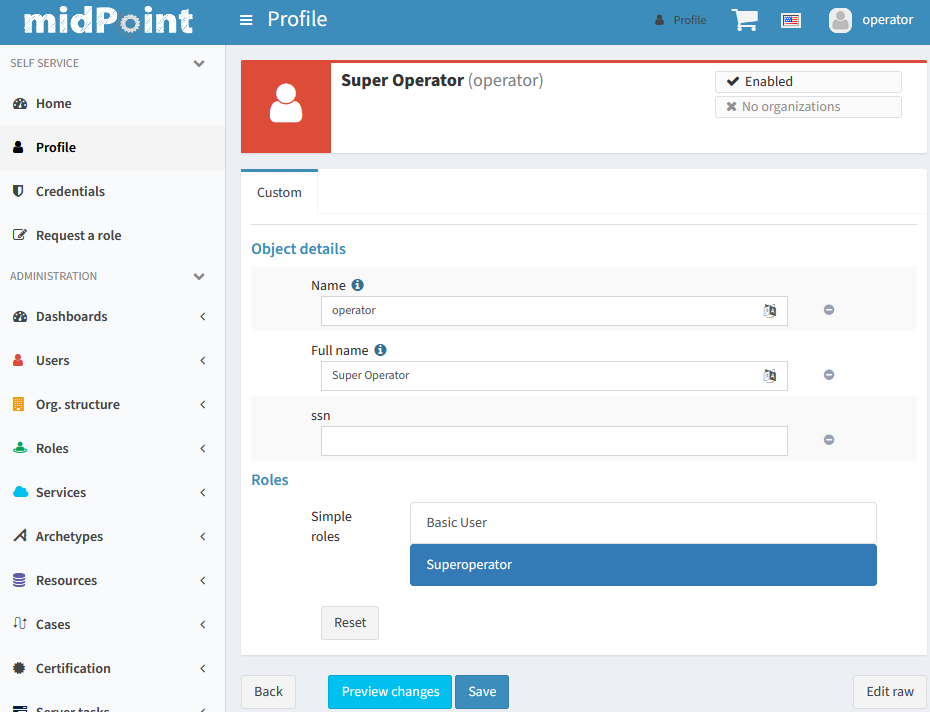
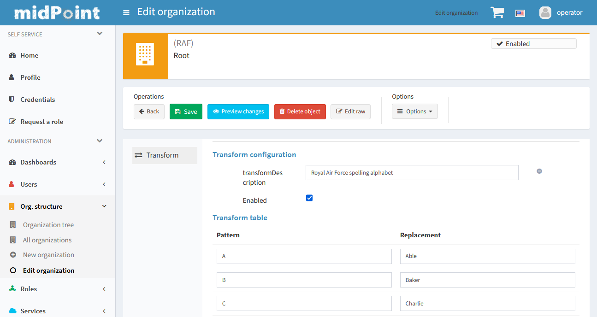

ifdef::env-github[]
:tip-caption: :bulb:
:note-caption: :information_source:
:important-caption: :heavy_exclamation_mark:
:caution-caption: :fire:
:warning-caption: :warning:
endif::[]
:toc:
:toc-placement!:

= midPoint Overlay Example

toc::[]

MidPoint overlays allow to heavily customize midPoint without the need to modify midPoint source code.
This example serves two purposes:

* to showcase simple GUI customization with a couple of new forms;
* to be the canonical example for overlays, documenting the changes between versions, etc.

This example is described in this README below.

Following generic overlay points are documented in separate documents in this project:

* link:doc/overlay-development.adoc[Overlay development]

Other overlay examples managed by Evolveum:

* https://github.com/Evolveum/midpoint-custom-soap-service-wsdl[Custom SOAP service]
with contract-first (WSDL) approach and WS-Security authentication (based on CXF).
* https://github.com/Evolveum/midpoint-custom-soap-service[Custom SOAP service]
with code-first approach only using midPoint built-in basic authentication (based on CXF).
* https://github.com/Evolveum/midpoint-custom-rest-service[Custom REST service]
with CXF-based REST and (since 4.2) experimentally also simplified Spring MVC based REST endpoint.

Additional information about midPoint customizations with overlays are also available at
https://wiki.evolveum.com/display/midPoint/Customization+With+Overlay+Project[this documentation page].

== Recent overlay changes

// Make include from this section when GitHub will support asciidoc includes
// Use it here and in overlay-development.adoc

Changes for midPoint 4.2:

* Spring Boot in version 2.3.3 is used.
It is recommended to use dependencies from https://docs.spring.io/spring-boot/docs/2.3.3.RELEASE/reference/html/appendix-dependency-versions.html[this list]
with the versions stated there if it is available.
* SOAP is gone as are some CXF dependencies.
It may be necessary to specify versions for CXF dependencies if used in overlay.
CXF servlet must be configured in the overlay now, see https://github.com/Evolveum/midpoint-custom-soap-service-wsdl[Custom SOAP service] for example.
* Usage of *midpoint-war-layout* is obsolete now.
See https://github.com/Evolveum/midpoint/blob/master/dist/src/main/bin/midpoint.sh[midpoint.sh]
for details how `${midpoint.home}/lib` is included to classpath (search for `-Dloader.path`).
* Various package name changes in Prism and GUI, changes in `import` statements are required.
* Custom Wicket `Form` in midPoint was renamed to `MidpointForm` to avoid name clashes.
* See also https://wiki.evolveum.com/x/5gDpAg[Release notes for midPoint 4.2].

During development of midPoint 4.1, following Maven artifact coordinates were changed:

* Parent POM `com.evolveum.midpoint:parent` was removed and replaced by `com.evolveum.midpoint:midpoint`.
* `com.evolveum.midpoint:midpoint-war-layout` was changed to `com.evolveum.midpoint.tools:midpoint-war-layout`.
* See also https://wiki.evolveum.com/display/midPoint/Release+4.1[Release notes for midPoint 4.1].

Further, *JDK 11 is now used for overlays* just as recommended for midPoint.

== This overlay example

=== Building and running

To build this example use JDK 11 and run (in the root of the repository):
----
mvn clean package
java -jar target/midpoint.war
----

Wait until the midPoint starts - you can check the progress in another terminal with:
----
tail -f ~/midpoint/log/midpoint.log
----

To run in an IDE choose `com.evolveum.midpoint.web.boot.MidPointSpringApplication` as the main class.
Be sure to add "provided" scope to the classpath in the run configuration.
*If `midpoint.home` does not exist run as JAR first, not IDE, otherwise `initial-objects` loading fails.*

=== Customized forms

To see the customized forms:

* In your browser open: http://localhost:8080
* Log in as user `operator` with the password `5ecr3t`.
* Try to edit any user or just click http://localhost:8080/midpoint/self/profile/user[Profile].

You will see the completely customized form (implemented in `ExtendedFormFocusTabPanel`):

There is also the custom form for editing an organization (class `ConfigurationTableTabPanel`):

=== Schema extension and initial objects

This overlay demonstrates usage of both
https://wiki.evolveum.com/display/midPoint/Custom+Schema+Extension[custom schema extension]
and custom initial objects.

For details see the respective sections in link:doc/overlay-development.adoc[Overlay development].
